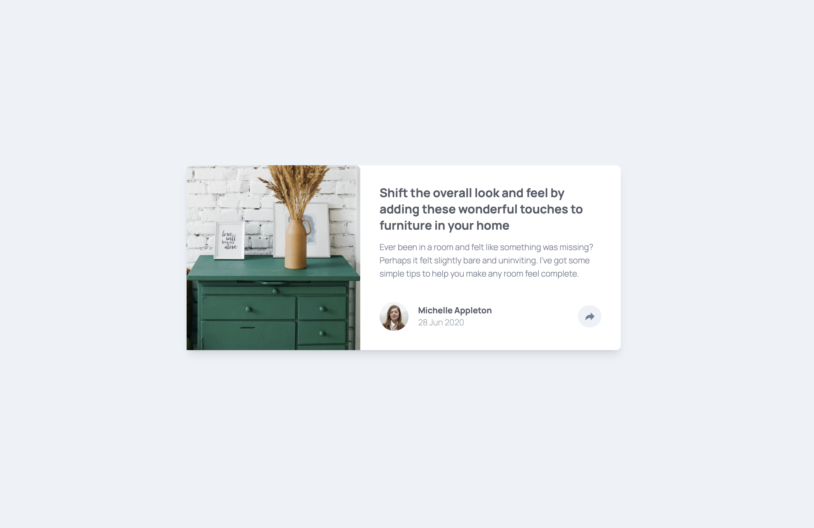
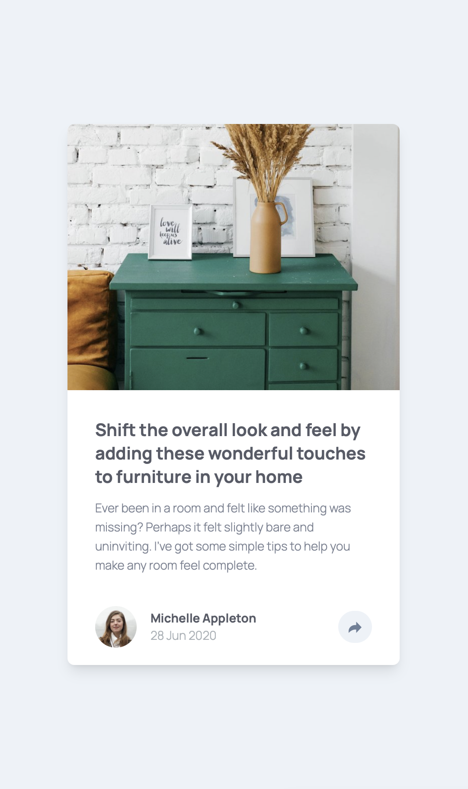

# Frontend Mentor - Article Preview Component

This is my solution to the [Article Preview Component challenge on Frontend Mentor](https://www.frontendmentor.io/challenges/article-preview-component-dYBN_pYFT).  
It was built using **HTML5**, **Tailwind CSS**, and **JavaScript**. The goal was to create a responsive article preview component with an interactive share functionality that adapts beautifully between desktop and mobile devices.

---

## 🔗 Live Site

👉 [Live preview here](https://umutyavyz.github.io/Frontend-Mentor-Article-Preview-Component/)

---

## 📸 Screenshots

### Desktop Design

### Mobile Design  

---

## 🛠️ Technologies Used

- HTML5
- Tailwind CSS
- JavaScript (ES6+)
- Responsive Design
- Git & GitHub
- [Frontend Mentor](https://www.frontendmentor.io/)

---

## ✨ Features

- **Responsive Design**: Seamlessly adapts from desktop to mobile
- **Interactive Share Button**: Click to reveal social media sharing options
- **Desktop Tooltip**: Elegant tooltip popup for desktop users
- **Mobile Share Bar**: Full-width sharing bar that replaces author info on mobile
- **Smooth Animations**: Hover effects and transitions for better UX
- **Accessibility**: Proper ARIA labels and semantic HTML

---

## 💡 What I Learned

- Creating responsive layouts that change behavior between screen sizes
- Implementing JavaScript toggle functionality for different UI states
- Working with Tailwind CSS utility classes for rapid styling
- Managing state changes between desktop tooltip and mobile share bar
- Using CSS transitions and hover effects for smooth interactions
- Handling responsive images and maintaining aspect ratios
- Creating accessible interactive components with proper ARIA labels

---

## 🧩 Useful Resources

- [Tailwind CSS Documentation](https://tailwindcss.com/docs)
- [MDN JavaScript Events](https://developer.mozilla.org/en-US/docs/Web/Events)
- [Frontend Mentor Challenges](https://www.frontendmentor.io/challenges)
- [CSS Transitions Guide](https://developer.mozilla.org/en-US/docs/Web/CSS/CSS_Transitions)
- [Responsive Design Patterns](https://web.dev/patterns/layout/)
- [ARIA Labels Best Practices](https://developer.mozilla.org/en-US/docs/Web/Accessibility/ARIA/Attributes/aria-label)

---

## ✍️ Author

- GitHub: [@umutyavyz](https://github.com/umutyavyz)  
- Frontend Mentor: [@umutyavyz](https://www.frontendmentor.io/profile/umutyavyz)  

---

## 📜 License

This project is open source and available under the [MIT License](LICENSE).
